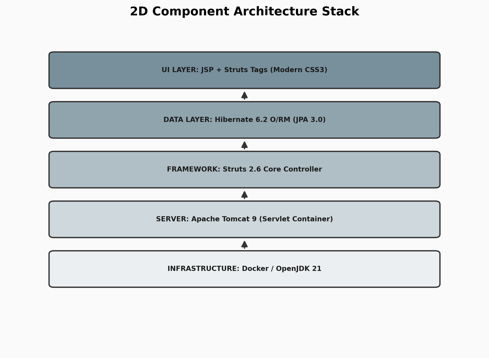

# 🏛️ JPMC Treasury Portal

## 1. Abstract
The **JPMC Treasury Portal** is a high-availability enterprise financial system designed to manage global corporate liquidity and high-value transfers. This project specifically addresses the critical problem of **internal fraud and operational risk** by implementing a strict **Maker-Checker (Dual-Authorization)** protocol, where no single individual can initiate and approve a transaction. The final output is a secure, production-hardened platform that provides immutable forensic logs, real-time visibility into account balances, and atomic database consistency for institutional-grade financial integrity.

## 2. Technology Used
*   **Programming Language**: Java 21 (JDK 21)
*   **Framework**: Apache Struts 2.6 (Interceptor-based MVC Architecture)
*   **Database**: PostgreSQL (Production) / H2 (Development)
*   **O/RM Layer**: Hibernate 6.2 (ACID Transactional Logic)
*   **Build & Server**: Maven 3.9+, Apache Tomcat 9, Docker
*   **IDE / Software**: VS Code, Git, Postman

## 3. Flow Diagram / Working
The portal utilizes a centralized request-response cycle where all routing is strictly managed via the Struts 2 Filter Dispatcher and a deep security interceptor stack.

### 🔄 Operational Flow:
1.  **HTTP Request**: User hits the portal URL (e.g., `/initiateTransfer.action`).
2.  **Security Guard**: The request passes through Authentication and Audit Interceptors.
3.  **Action Execution**: The Java layer processes business logic and updates the state.
4.  **Database Commit**: Hibernate ensures atomic persistence of the financial event.
5.  **Response**: The system returns a secure JSP view or JSON data.

## 4. Implementation
The project is built on a modular decoupled architecture using the **Model-View-Controller (MVC)** pattern. The key implementation logic involves a multi-layered security stack where every transaction is first staged in a `PENDING` state by a **Maker** and subsequently authorized by a **Checker** to ensure institutional control. We utilized **Hibernate 6** to manage the "Session-per-Request" pattern, ensuring that data is lazily loaded into the UI while maintaining strict database connection pools. The entire platform is containerized using **Docker** for consistent execution across all environments.

## 5. Output Screenshot
Below are the live captures of the portal in operation:

### 5.1 Portal Authentication (Login)

### 5.2 Liquidity Dashboard & Reports

## 6. QR Code for GitHub Link
Scan the QR code below to view the full source code, forensic documentation, and technical diagrams on GitHub.

### **Scan to view project/demo**

---
*Developed for the JPMC Advanced Agentic Coding Certification.*
