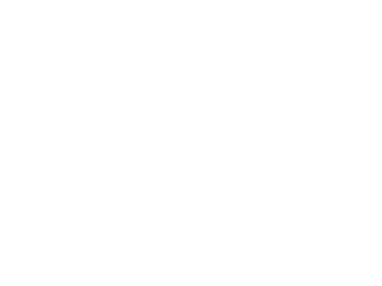
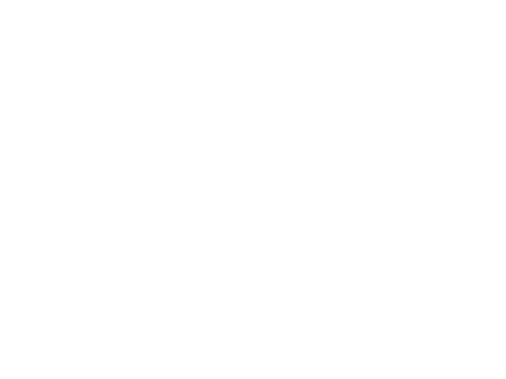
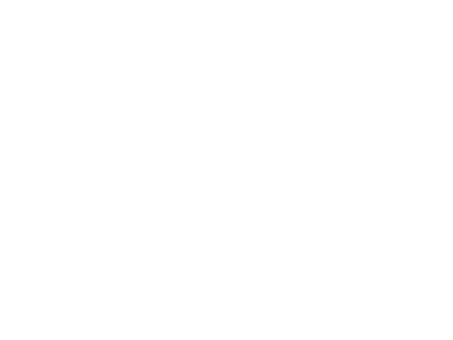

# 🏛️ JPMC Corporate Treasury Portal

A secure, high-performance treasury management system built with Apache Struts 2 and Hibernate. Designed for mission-critical liquidity management and dual-authorization financial workflows.

### 📖 Technical Documentation & Interview Prep
For a detailed breakdown of the architecture, security model, and interview questions, see:
👉 **[README_FORENSIC.md](README_FORENSIC.md)**

---

## 🏗️ 1. Infrastructure Architecture
The application is designed for cloud-native deployment using Docker and is optimized for platforms like Render or Hugging Face.

## 📊 2. Data Model (ER Diagram)
The database schema enforces strict relational integrity between users, their accounts, and the financial operations they perform.

## 🔄 3. System Workflows

### 3.1 Security & Interceptor Pipeline
The portal uses a "Deep Security" model where every request must pass through a stack of specialized interceptors before reaching the business logic.

### 3.2 Maker-Checker Sequential Logic
The interaction between system participants follows a rigid sequence of events to maintain financial compliance and dual-authorization.

### 3.3 Maker-Checker Financial Lifecycle
To ensure institutional control, money movement requires two distinct roles. A **Maker** initiates the request, and a **Checker** must authorize it.

## 🛠️ 4. Technology Stack
*   **Backend Core**: Java 21, Struts 2.6.x
*   **Data Persistence**: Hibernate 6.2 (JPA), Flyway (Migrations)
*   **Security Stack**: Custom Interceptor-based Authentication & Auditing
*   **API Support**: Struts2-JSON Plugin for automated auditing tools
*   **Database**: H2 (In-memory dev) / PostgreSQL (Production)
*   **Infrastructure**: Docker, Tomcat 9+

## ⚖️ 5. Security & Compliance
*   **WEB-INF Protection**: All JSP templates are hidden from direct public access.
*   **BCrypt Encryption**: Passwords are never stored in plain text.
*   **Audit Transparency**: A dedicated `/audit.action` endpoint provides auditors with real-time oversight.
*   **API Hardening**: All actions support `format=json` for integration with external forensic auditing tools.

---
*Created for the JPMC Advanced Agentic Coding Demonstration.*
