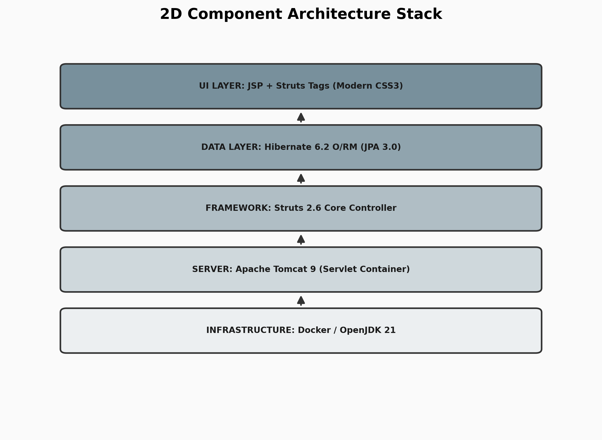

# 🏛️ System Architecture

The JPMC Treasury Portal utilizes a multi-layered, decoupled architecture designed for high availability and institutional security.

## Component Stack
The system is built on an enterprise-grade stack, ensuring that the infrastructure, server, and application logic remain independent and scalable.

### 1. The Server Layer: Apache Tomcat 9
The application runs on **Apache Tomcat 9**, a high-performance Servlet 4.0 container. Tomcat handles the low-level HTTP lifecycle, thread pooling, and JSP compilation, providing a stable foundation for the Struts 2 dispatcher.

### 2. The Framework Layer: Struts 2.6
We use **Struts 2.6** (Zero-XML style) for routing. The **FilterDispatcher** intercepts every incoming request and directs it through a chain of **Interceptors** before the core Action executes.

### 3. Data Persistence: Hibernate 6.2
Hibernate manages the conversion of Java objects (Users, Accounts) into SQL rows. We utilize the **Session-per-Request** pattern to ensure database connections are efficiently managed.
