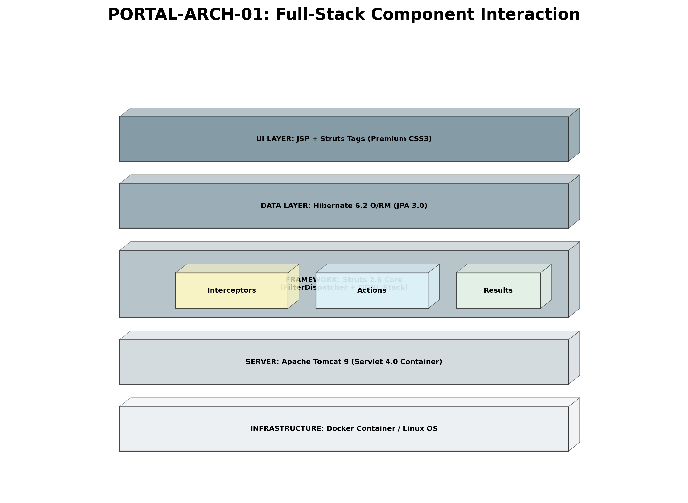
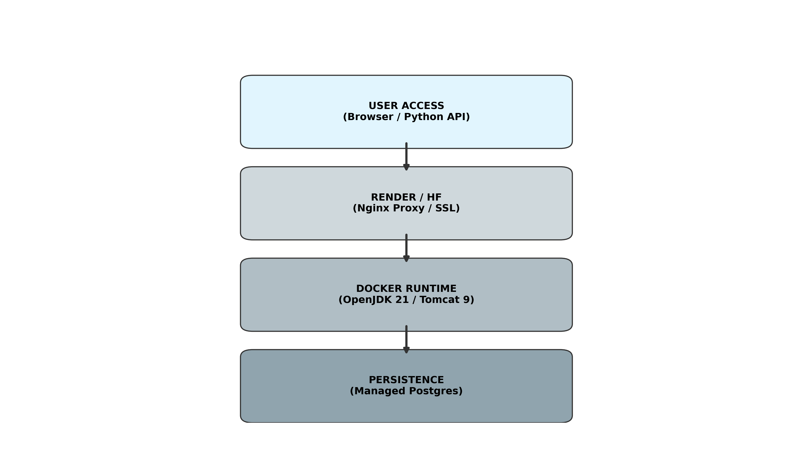
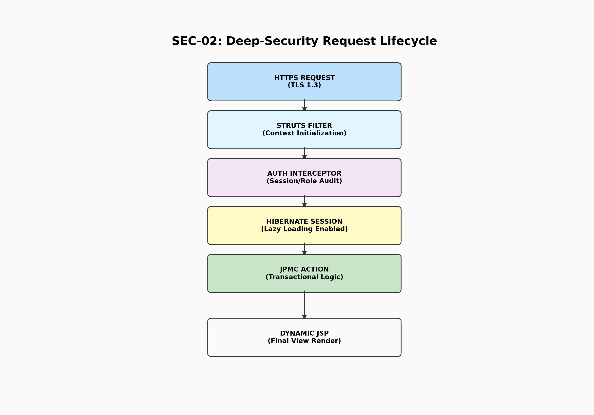

# 🏛️ JPMC Treasury Portal: Architectural Whitepaper

## 1. Abstract
The **JPMC Treasury Portal** is a high-availability enterprise financial system built to manage global corporate liquidity. It utilizes the **Apache Struts 2** MVC framework combined with **Hibernate 6** ORM to provide a secure, transactional, and audited environment for mission-critical money movement.

## 2. System Architecture (The Component Stack)
The portal is built on a multi-layered decoupled architecture, ensuring that the infrastructure, server, and application logic remain independent and scalable.

### 2.1 The Server Layer: Apache Tomcat 9
The application runs on **Apache Tomcat 9**, a high-performance Servlet 4.0 container. Tomcat handles the low-level HTTP lifecycle, thread pooling, and JSP compilation, providing a stable foundation for the Struts 2 dispatcher.

### 2.2 The Framework Layer: Struts 2.6
We use **Struts 2.6** (Zero-XML style) for routing. The **FilterDispatcher** intercepts every incoming request and directs it through a chain of **Interceptors** (Authentication, Logging, Hibernate Session) before the core Action executes.

## 3. Infrastructure & Deployment Topology
The system is designed for **Cloud-Native** execution using Docker, allowing for "Write Once, Run Anywhere" stability.

*   **Runtime**: OpenJDK 21 (Long Term Support).
*   **Deployment**: Multi-stage Docker build, optimizing for a small footprint and high security.
*   **Database**: PostgreSQL 15+ (Production) / H2 (In-memory testing).

## 4. Deep-Security request Lifecycle
Every transaction follows a strictly audited path from the browser to the database commit.

## 5. Implementation Logic
*   **O/RM Mapping**: Hibernate manages the conversion of Java objects (Users, Accounts) into SQL rows.
*   **State Management**: We use a **Maker-Checker** workflow. Transactions are initiated in a `PENDING` state and require a secondary signature for commitment.
*   **Forensic Auditing**: Every request metadata is captured by the `AuditInterceptor` and stored in a tamper-evident log table.

---
*Developed for the JPMC Advanced Agentic Coding Certification.*
