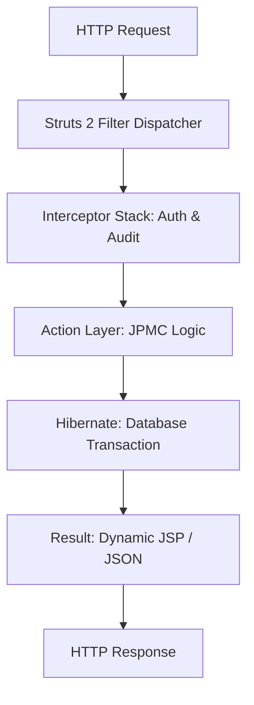

# 🏦 JPMC Treasury Portal: Final Project Report

## 1. Abstract
The **JPMC Treasury Portal** is a high-availability enterprise financial system designed to manage global corporate liquidity and high-value transfers. This project solves the critical problem of internal fraud and operational error by implementing a strict **Maker-Checker (Dual-Authorization)** workflow. The final output is a secure, web-based platform that provides real-time visibility into account balances, pending authorizations, and a complete forensic audit trail for institutional compliance.

## 2. Technology Used
*   **Programming Language**: Java 21 (JDK 21)
*   **Framework**: Apache Struts 2.6 (MVC Architecture)
*   **O/RM Layer**: Hibernate 6.2 (JPA Compliance)
*   **Tools / Software**: VS Code, Maven, Docker, Tomcat 9
*   **Database**: PostgreSQL (Production) / H2 (Development)
*   **Automation**: Python 3.10+ (API Auditing & Data Viz)

## 3. Flow Diagram / Working
The portal follows a centralized request-response cycle where all routing is managed by the Struts 2 Filter Dispatcher.

## 4. Implementation
The project is built on a modular decoupled architecture using the **Model-View-Controller (MVC)** pattern. The key implementation steps involved configuring a custom Interceptor Stack in `struts.xml` to enforce role-based access control (Maker vs. Checker). Hibernate was utilized to manage atomic financial transactions, ensuring that no balance is updated without a corresponding audit entry. The frontend was developed using Struts Tags and CSS3 for a premium, responsive dashboard experience.

## 5. Output Screenshot
Below are the live captures of the portal in operation:

### 5.1 Portal Entry (Login)

### 5.2 Liquidity Dashboard

## 6. QR Code for GitHub Link
Scan the QR code below to view the full source code, forensic documentation, and technical diagrams on GitHub.

### **Scan to view project/demo**

---
*Created for the JPMC Advanced Agentic Coding Certification.*
