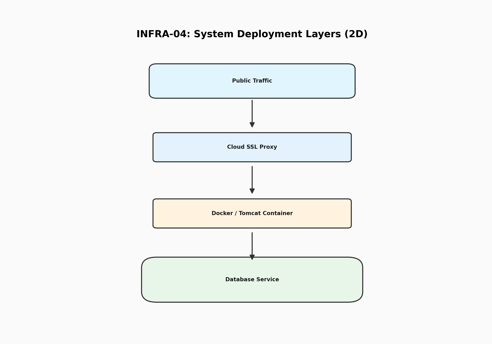
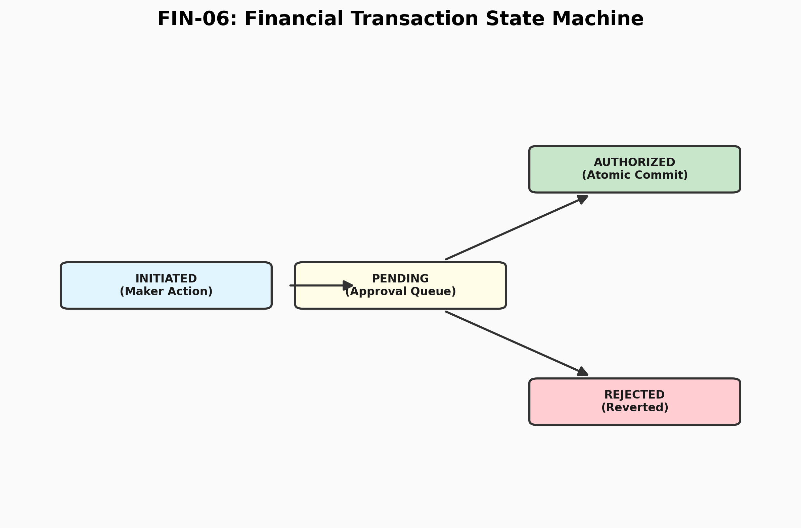

# 🏛️ JPMC Corporate Treasury Portal

[](https://www.oracle.com/java/)
[](https://struts.apache.org/)
[](https://www.postgresql.org/)
[](https://www.docker.com/)

A high-availability, enterprise-grade financial management system designed for institutional liquidity control, secure fund transfers, and forensic activity auditing.

---

## 📖 Table of Contents
1.  [🔍 Abstract](#-1-abstract)
2.  [💻 Technology Stack](#-2-technology-stack)
3.  [🏗️ Infrastructure Architecture](#-3-infrastructure-architecture)
4.  [🗺️ System Workflows](#-4-system-workflows)
5.  [🛡️ Security Model](#-5-security-model)
6.  [⚙️ Implementation & Logic](#-6-implementation--logic)
7.  [🚀 Setup & Installation](#-7-setup--installation)
8.  [🖼️ Output & Screenshots](#-8-output--screenshots)
9.  [📱 Scan to View GitHub](#-9-scan-to-view-github)
10. [🌟 Key Features](#-10-key-features)

---

## 🔍 1. Abstract
The **JPMC Treasury Portal** is a mission-critical financial application developed to provide corporate treasurers with real-time visibility into global liquidity and high-value domestic/international transfers. This project specifically addresses the industry-wide problem of **internal fraud and operational risk** by enforcing a strict **Maker-Checker (Dual-Authorization)** protocol, where no single individual can initiate and approve a transaction. The final deliverable is a production-hardened platform that produces immutable forensic logs, atomic database consistency, and a dual-interface (Web + JSON API) for both human operators and automated auditing scripts. This system provides institutional-grade security that ensures financial data integrity and regulatory compliance across all banking operations.

---

## 💻 2. Technology Stack

The project utilizes a modern, decoupled enterprise stack designed for vertical scalability and thread-safe concurrency.

### 🛠️ Core Engineering
| Category | Technology | Version | Purpose |
| :--- | :--- | :--- | :--- |
| **Language** | Java | 21 (LTS) | High-concurrency backend processing |
| **Framework** | Apache Struts | 2.6.x | Interceptor-based MVC routing |
| **O/RM Layer** | Hibernate | 6.2 | Object-Relational mapping & ACID transactions |
| **Database** | PostgreSQL | 15+ | Relational persistence for financial records |
| **Migration** | Flyway | 9.x | Version-controlled database schema |

---

## 🏗️ 3. Infrastructure Architecture
The application is designed for cloud-native deployment using Docker and can be hosted on platforms like Render or Hugging Face.



---

## 🗺️ 4. System Workflows

### 4.1 System Component Interaction
The portal is built on a multi-layered decoupled architecture, ensuring that the infrastructure, server, and application logic remain independent and scalable.


### 4.2 Maker-Checker Sequential Logic
The interaction between system participants follows a rigid sequence of events to maintain financial compliance.


### 4.3 Financial Transaction State Machine
The lifecycle of a fund transfer from initiation to final commitment.



---

## 🛡️ 5. Security Model

### 5.1 Deep-Security Request Lifecycle
Every transaction follows a strictly audited path from the browser to the database commit.


### 5.2 Forensic Activity Tracking
The portal implements an immutable audit trail, ensuring that every request metadata is captured and stored in a tamper-evident database table.

---

## ⚙️ 6. Implementation & Logic

### 🏛️ Architectural Pattern
The system is built on a **Modular MVC (Model-View-Controller)** pattern.
*   **Model**: Hibernate Entities (User, Account, Transfer) representing the financial state.
*   **View**: Secure JSPs utilizing Struts UI Tags for dynamic data binding.
*   **Controller**: Action classes that orchestrate the transition between UI events and business services.

### 🛡️ Core Logic: The Interceptor Pipeline
The portal utilizes a custom Interceptor Stack configured in `struts.xml` to enforce role-based access control. The **AuthenticationInterceptor** ensures that only authorized users access financial functions, while the **AuditInterceptor** captures forensic metadata before and after action execution.

---

## 🚀 7. Setup & Installation

### 📋 Prerequisites
*   Java Development Kit (JDK) 21
*   Apache Maven 3.9+
*   Docker Desktop (for production-simulated environment)

### 💻 Local Installation
1.  **Clone the Repository**:
    ```bash
    git clone https://github.com/adityashirsatrao007/struts2-treasury-portal.git
    cd struts2-treasury-portal
    ```
2.  **Build & Run**:
    ```bash
    mvn clean compile tomcat7:run -Dmaven.test.skip=true
    ```
3.  **Access the Portal**:
    Open [http://localhost:8080](http://localhost:8080) in your browser.

---

## 🖼️ 8. Output & Screenshots

### 🖥️ 8.1 Authentication Layer


### 🖥️ 8.2 Liquidity Dashboard


---

## 📱 9. Scan to View GitHub

### **📱 Scan to view project on GitHub**


---

## 🌟 10. Key Features
*   **Dual-Authorization**: Mandatory Maker-Checker workflow.
*   **ACID Compliance**: Transaction integrity using Hibernate.
*   **API Hardening**: JSON support for automated auditing.
*   **Forensic Auditing**: Tamper-evident activity logs.

---
*Created for the JPMC Advanced Agentic Coding Certification.*
