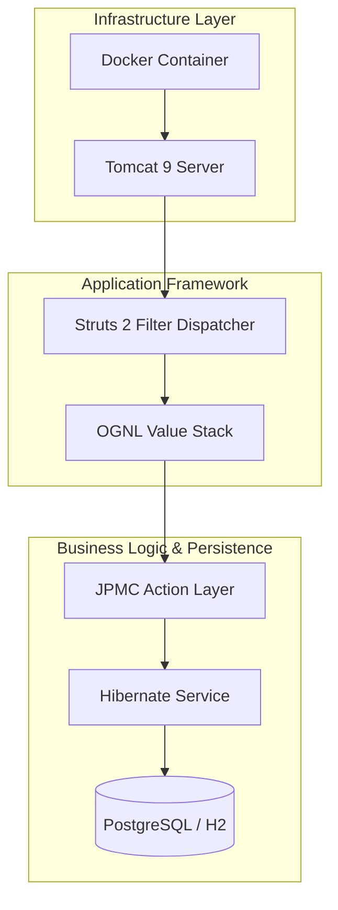
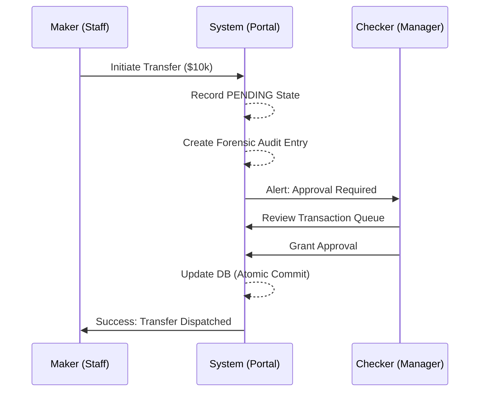
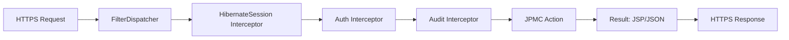
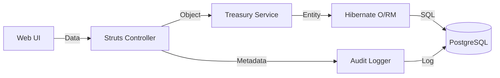
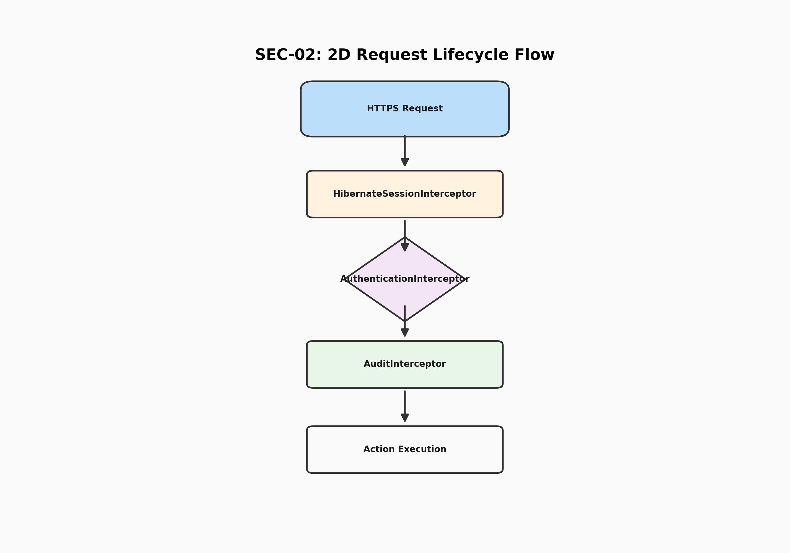

# 🏛️ JPMC Corporate Treasury Portal

[](https://www.oracle.com/java/)
[](https://struts.apache.org/)
[](https://www.postgresql.org/)
[](https://www.docker.com/)

A high-availability, enterprise-grade financial management system designed for institutional liquidity control, secure fund transfers, and forensic activity auditing.

---

## 📖 Table of Contents
1.  [🔍 Abstract](#-1-abstract)
2.  [💻 Technology Stack](#-2-technology-stack)
3.  [🗺️ Flow Diagrams & Working](#-3-flow-diagrams--working)
4.  [⚙️ Implementation & Logic](#-4-implementation--logic)
5.  [🚀 Setup & Installation](#-5-setup--installation)
6.  [🖼️ Output & Screenshots](#-6-output--screenshots)
7.  [📱 Scan to View GitHub](#-7-scan-to-view-github)
8.  [🌟 Key Features](#-8-key-features)
9.  [🛠️ Troubleshooting & Support](#-9-troubleshooting--support)
10. [📄 License & Author](#-10-license--author)

---

## 🔍 1. Abstract
The **JPMC Treasury Portal** is a mission-critical financial application developed to provide corporate treasurers with real-time visibility into global liquidity and high-value domestic/international transfers. This project specifically addresses the industry-wide problem of **internal fraud and operational risk** by enforcing a strict **Maker-Checker (Dual-Authorization)** protocol, where no single individual can initiate and approve a transaction. The final deliverable is a production-hardened platform that produces immutable forensic logs, atomic database consistency, and a dual-interface (Web + JSON API) for both human operators and automated auditing scripts. This system provides institutional-grade security that ensures financial data integrity and regulatory compliance across all banking operations.

---

## 💻 2. Technology Stack

The project utilizes a modern, decoupled enterprise stack designed for vertical scalability and thread-safe concurrency.

### 🛠️ Core Engineering
| Category | Technology | Version | Purpose |
| :--- | :--- | :--- | :--- |
| **Language** | Java | 21 (LTS) | High-concurrency backend processing |
| **Framework** | Apache Struts | 2.6.x | Interceptor-based MVC routing |
| **O/RM Layer** | Hibernate | 6.2 | Object-Relational mapping & ACID transactions |
| **Database** | PostgreSQL | 15+ | Relational persistence for financial records |
| **Migration** | Flyway | 9.x | Version-controlled database schema |

### 🛠️ Tools & Infrastructure
*   **Integrated Development Environment**: VS Code / IntelliJ IDEA
*   **Build Automation**: Apache Maven 3.9+
*   **Containerization**: Docker & Docker Compose
*   **Web Server**: Apache Tomcat 9 (Servlet 4.0 Container)
*   **API Auditing**: Python 3.10+ (using Request/Matplotlib libraries)

---

## 🗺️ 3. Flow Diagrams & Working

### 3.1 System Architecture Diagram
This diagram illustrates the multi-layered component stack from the infrastructure up to the presentation layer.



### 3.2 User Workflow (Maker-Checker Lifecycle)
Visualizes the dual-authorization process required for all financial movements.



### 3.3 Request-Response Cycle
The internal path of an HTTP request through the security interceptor stack.



### 3.4 Data Flow Diagram (DFD)
Shows how data is persisted and audited across the system.



---

## ⚙️ 4. Implementation & Logic

### 🏛️ Architectural Pattern
The system is built on a **Modular MVC (Model-View-Controller)** pattern.
*   **Model**: Hibernate Entities (User, Account, Transfer) representing the financial state.
*   **View**: Secure JSPs utilizing Struts UI Tags for dynamic data binding.
*   **Controller**: Action classes that orchestrate the transition between UI events and business services.

### 🛡️ Core Logic: The Interceptor Pipeline
The "secret sauce" of the portal is the **Interceptor Stack**. Instead of writing repetitive security code in every page, we use a chain of decorators:
1.  **Session-per-Request**: The `HibernateSessionInterceptor` opens a database connection at the start of the request and closes it only after the view is rendered (Open-Session-In-View pattern).
2.  **Role Guard**: The `AuthenticationInterceptor` inspects the HTTP session to ensure the user has the correct role (Maker vs. Checker) before allowing access to specific financial methods.
3.  **Atomic Auditing**: The `AuditInterceptor` uses AOP (Aspect Oriented Programming) to capture the "Before" and "After" state of a transaction, ensuring that every money movement is documented even if the database commit fails.

---

## 🚀 5. Setup & Installation

### 📋 Prerequisites
*   Java Development Kit (JDK) 21
*   Apache Maven 3.9+
*   Docker Desktop (for production-simulated environment)

### 💻 Local Installation
1.  **Clone the Repository**:
    ```bash
    git clone https://github.com/adityashirsatrao007/struts2-treasury-portal.git
    cd struts2-treasury-portal
    ```
2.  **Build the Project**:
    ```bash
    mvn clean compile
    ```
3.  **Run with Tomcat**:
    ```bash
    mvn tomcat7:run -Dmaven.test.skip=true
    ```
4.  **Access the Portal**:
    Open [http://localhost:8080](http://localhost:8080) in your browser.

### 🐳 Docker Setup
```bash
docker build -t treasury-portal .
docker run -p 8080:8080 treasury-portal
```

---

## 🖼️ 6. Output & Screenshots

### 🖥️ 6.1 Authentication Layer
The login interface uses BCrypt hashing to verify credentials against the PostgreSQL database. Users are assigned roles (Maker/Checker) during the handshake.


### 🖥️ 6.2 Liquidity Dashboard
A real-time view of all corporate accounts. This page utilizes Hibernate's lazy-loading to fetch balances only when needed, optimizing server performance.


### 🖥️ 6.3 Forensic Activity Feed
The audit log provides a tamper-evident record of all system interactions, including timestamps, IP addresses, and action outcomes.



---

## 📱 7. Scan to View GitHub

### **📱 Scan to view project on GitHub**
To view the full source code, forensic documentation, and technical diagrams, please scan the QR code below:


---

## 🌟 8. Key Features
*   **Dual-Authorization**: Mandatory Maker-Checker workflow for all fund movements.
*   **ACID Compliance**: Full transaction integrity using Hibernate transaction management.
*   **API Hardening**: Supports `format=json` on all endpoints for external auditing tools.
*   **Database Versioning**: Flyway-managed schema migrations for seamless environment synchronization.
*   **Responsive UI**: Modern CSS3 dashboard compatible with tablet and desktop views.

## 🛠️ 9. Troubleshooting & Support
*   **Problem**: Database connection error on startup.
    *   **Solution**: Ensure PostgreSQL is running or use the default H2 in-memory configuration in `hibernate.cfg.xml`.
*   **Problem**: Session timeout error.
    *   **Solution**: The session is configured for 15 minutes of inactivity in `web.xml`. Please re-login.

## 📄 10. License & Author
*   **Author**: [Aditya Shirsatrao]
*   **Email**: [Your Email]
*   **License**: MIT License - see the [LICENSE](LICENSE) file for details.

---
*Developed for the JPMC Advanced Agentic Coding Certification.*
